### 数据JSON化

https://javiercbk.github.io/json_to_dart/

### 表单输入框焦点

```dart
import 'package:flutter/material.dart';

void main() {
  runApp(MaterialApp(
    home: Scaffold(
      appBar: AppBar(
        title: Text("Test"),
        centerTitle: true,
      ),
      body: MyApp(),
    ),
  ));
}

class MyApp extends StatefulWidget {
  const MyApp({Key key}) : super(key: key);

  @override
  State<MyApp> createState() => _MyAppState();
}

class _MyAppState extends State<MyApp> {
  GlobalKey _key = GlobalKey<FormState>();
  TextEditingController _user = TextEditingController();
  TextEditingController _pass = TextEditingController();
  FocusNode _u = FocusNode();
  FocusNode _p = FocusNode();
  FocusScopeNode _focusScopeNode;
  @override
  void dispose() {
    super.dispose();
    _user.dispose();
    _pass.dispose();
    _u.dispose();
    _p.dispose();
    if (_focusScopeNode != null) _focusScopeNode.dispose();
  }

  @override
  Widget build(BuildContext context) {
    return Form(
      key: _key,
      autovalidate: true,
      child: Column(
        children: [
          TextFormField(
            focusNode: _u,
            autofocus: true,
            controller: _user,
            decoration: InputDecoration(
                suffixIcon: Icon(Icons.add),
                labelText: "账号",
                hintText: "请输入账号!"),
            validator: (v) {
              if (v == null || v.isEmpty) {
                return "账号必须输入!";
              }
            },
            textInputAction: TextInputAction.next,
            onFieldSubmitted: (v) {
              print("object");
            },
            onChanged: (v) {
              print(v);
            },
          ),
          TextFormField(
            focusNode: _p,
            controller: _pass,
            decoration: InputDecoration(
                suffixIcon: Icon(Icons.add),
                labelText: "密码",
                hintText: "请输入密码"),
            validator: (v) {
              if (v == null || v.length < 5) {
                return "密码必须输入且大于5!";
              }
            },
            textInputAction: TextInputAction.send,
            onChanged: (v) {
              print(v);
            },
            obscureText: true,
          ),
          SizedBox(
            height: 16,
          ),
          ElevatedButton(
            onPressed: () {
              if (_focusScopeNode == null) {
                _focusScopeNode = FocusScope.of(context);
              }
              _focusScopeNode.requestFocus(_u);
              _focusScopeNode.unfocus();
              print((_key.currentState as FormState).validate().toString());
            },
            child: Text("提交"),
          )
        ],
      ),
    );
  }
}

```

### 路由

```dart
import 'package:flutter/material.dart';

void main() {
  runApp(MyApp());
}

class MyApp extends StatelessWidget {
  const MyApp({Key key}) : super(key: key);

  @override
  Widget build(BuildContext context) {
    return MaterialApp(
        debugShowCheckedModeBanner: false,
        routes: {
          "/": (context) => HomePage(),
          "menu": (context) => Home(),
        },
        //路由拦截
        onGenerateRoute: (s) {
          print(s.name);
          switch (s.name) {
            case "menu":
              return MaterialPageRoute(
                  builder: (context) {
                    return Home();
                  },
                  settings: s);
              break;
            default:
          }
        });
  }
}

class HomePage extends StatelessWidget {
  const HomePage({Key key}) : super(key: key);

  @override
  Widget build(BuildContext context) {
    return Scaffold(
      appBar: AppBar(
        centerTitle: true,
        title: Text("登录"),
      ),
      body: ElevatedButton(
          onPressed: () {
            Navigator.of(context)
                .pushNamed("menu", arguments: "菜单")
                .then((value) => print(value));
            // Navigator.of(context)
            //     .push(
            //       MaterialPageRoute(
            //         builder: (BuildContext context) {
            //           return Home();
            //         },
            //         settings: RouteSettings(
            //           name: "menu", //路由名称
            //           arguments: "max11", //参数
            //         ),
            //         maintainState: false, //false 释放路由资源
            //         fullscreenDialog: false, //是否全屏显示
            //       ),
            //     )
            //     .then((value) => print(value));
          },
          child: Text("登录")),
    );
  }
}

class Home extends StatelessWidget {
  // final String title;
  const Home({Key key}) : super(key: key);

  @override
  Widget build(BuildContext context) {
    dynamic arguments = ModalRoute.of(context).settings.arguments;
    return Scaffold(
      appBar: AppBar(
        centerTitle: true,
        title: Text(arguments),
      ),
      body: ElevatedButton(
          onPressed: () {
            Navigator.of(context).pop("幸运冰FLutter学习笔记");
          },
          child: Text("退出")),
    );
  }
}
```

### Row与Column

```dart
Scaffold(
        body: Container(
      width: double.infinity,
      color: Colors.grey,
      child: Row(
        textDirection: TextDirection.ltr, //排序次序，ltr:从左到右,rtl:从右到左
        mainAxisSize: MainAxisSize.max,
        mainAxisAlignment: MainAxisAlignment.spaceEvenly,
        crossAxisAlignment: CrossAxisAlignment.stretch, //纵轴的排列次序
        children: [
          Container(
            width: 50,
            height: 50,
            color: Colors.red,
          ),
          Container(
            width: 80,
            height: 80,
            color: Colors.amberAccent,
          ),
          Container(
            width: 100,
            height: 100,
            color: Colors.lightBlue,
          ),
        ],
      ),
    ));
```

### Flex弹性布局

```dart
import 'package:flutter/material.dart';

class RowCloumn extends StatelessWidget {
  const RowCloumn({Key key}) : super(key: key);

  @override
  Widget build(BuildContext context) {
    return Scaffold(
        body: Container(
      width: double.infinity,
      color: Colors.grey,
      child: Flex(
        direction: Axis.vertical, //布局方式，垂直布局
        children: [
          Expanded(
            child: Container(
              width: 100,
              height: 50,
              color: Colors.red,
            ),
            flex: 1, //权重
          ),
          Expanded(
            child: Container(
              width: 100,
              height: 80,
              color: Colors.amberAccent,
            ),
            flex: 2,
          ),
          Expanded(
            child: Container(
              width: 100,
              height: 100,
              color: Colors.lightBlue,
            ),
            flex: 3,
          )
        ],
      ),
    ));
  }
}
```

### Wrap流式布局

```dart
import 'package:flutter/material.dart';

class WrapTest extends StatefulWidget {
  const WrapTest({Key key}) : super(key: key);

  @override
  State<WrapTest> createState() => _WrapTestState();
}

class _WrapTestState extends State<WrapTest> {
  List<int> list = List();

  @override
  void initState() {
    super.initState();
    for (int i = 1; i < 20; i++) {
      list.add(i);
    }
  }

  @override
  Widget build(BuildContext context) {
    return Scaffold(
      body: Wrap(
        direction: Axis.vertical,
        alignment: WrapAlignment.spaceBetween,
        spacing: 10.0,
        runSpacing: 10.0,
        children: list
            .map(
              (e) => Container(
                width: 100,
                height: 100,
                color: Colors.lightBlue,
                child: Text(e.toString()),
              ),
            )
            .toList(),
      ),
    );
  }
}
```

### Stack布局与Positioned定位

```dart
import 'package:flutter/material.dart';

class Test extends StatelessWidget {
  const Test({Key key}) : super(key: key);

  @override
  Widget build(BuildContext context) {
    return Scaffold(
      body: Container(
        color: Colors.grey,
        width: double.infinity,
        child: Stack(
          alignment: AlignmentDirectional.topCenter,
          children: [
            Container(
              color: Colors.green,
              width: 100,
              height: 100,
            ),
            Container(
              color: Colors.red,
              width: 60,
              height: 100,
            ),
            Positioned(
              child: Container(
                color: Colors.green[700],
                // height: 100,
                width: 50,
              ),
              top: 10,
              bottom: 10,
            ),
          ],
        ),
      ),
    );
  }
}
//Positioned中不设置left,right,top,bottom时，Positioned遵循Stack中的alignment
```

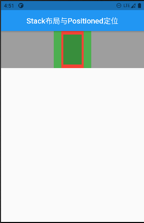

### Positioned进价

```dart
 body: Container(
        color: Colors.grey,
        width: double.infinity,
        child: Stack(
          fit: StackFit.expand,
          alignment: AlignmentDirectional.topCenter,
          children: [
            Container(
              color: Colors.green,
              width: 100,
              height: 100,
            ),
            Positioned(
              child: Container(
                color: Colors.red,
                width: 60,
                height: 100,
              ),
              left: 10,
            ),
            Positioned(
              child: Container(
                color: Colors.green[700],
                // height: 100,
                width: 50,
              ),
              top: 10,
              bottom: 10,
            ),
          ],
        ),
      ),
```

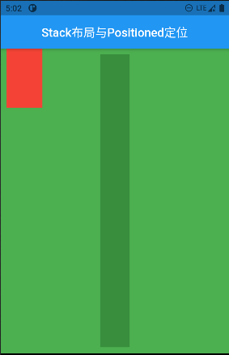

### 相对定位Align

```dart
Scaffold(
      appBar: AppBar(
        title: Text("相对定位"),
        centerTitle: true,
      ),
      body: Container(
        width: 200,
        height: 200,
        color: Colors.green,
        child: Align(
          alignment: Alignment(1, 1),//值为-1至1
          child: FlutterLogo(
            size: 60,
          ),
        ),
      ),
    );
//相对定位是相对于自己的父组件定位的
```

### padding和margin

```dart
padding: EdgeInsets.all(10),//内边距,相当于子组件
margin: EdgeInsets.all(10),//外边距，相当于父组件
```

### 尺寸限制ConstrainedBox与SizeBox

#### ConstrainedBox

```dart
Scaffold(
      appBar: AppBar(
        title: Text("尺寸限制"),
        centerTitle: true,
      ),
      body: ConstrainedBox(
        constraints: BoxConstraints(
          maxHeight: 100,
          maxWidth: 100,
          minHeight: 50,
          minWidth: 50,
        ),
        child: Container(
          width: 10,
          height: 500,
          color: Colors.red,
        ),
      ),
    ); //结果显示宽50高100的背景是红色的容器
```

#### SizeBox

```dart
SizedBox(
        width: 100,
        height: 100,
        child: Container(
          width: 50,
          height: 50,
          color: Colors.black,
        ),
      ),
    ); //结果显示宽100高100的背景是黑色的容器
```

### 装饰器DecoratedBox

```dart
 @override
  Widget build(BuildContext context) {
    return Scaffold(
      appBar: AppBar(
        title: Text("装饰器DecoratedBox"),
        centerTitle: true,
      ),
      body: Container(
        width: double.infinity,
        padding: EdgeInsets.all(20),
        child: DecoratedBox(
          decoration: BoxDecoration(
            gradient: LinearGradient(
              colors: [
                Colors.red,
                Colors.green,
              ],
            ),
            borderRadius: BorderRadius.circular(10), //圆角
            boxShadow: [
              BoxShadow(
                color: Colors.green,
                offset: Offset(2.0, 2.0),
                blurRadius: 4.0,
              ),
            ],
          ),
          child: Padding(
            padding:
                EdgeInsets.only(left: 100, right: 100, top: 10, bottom: 10),
            child: Text(
              "注册",
              style: TextStyle(
                color: Colors.white,
              ),
              textAlign: TextAlign.center,
            ),
          ),
        ),
      ),
    );
  }
```

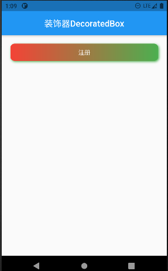

### 小容器Container

```dart
alignment 对齐方式
padding/margin 内间距/外间距
foregroundDecoration 前景色
color/decoration 背景色 decoration与color不能同时使用
transform 旋转
```

 

### MaterialApp与AppBar

#### MaterialApp

```dart
MaterialApp({
  Key key,
  this.title = '', // 设备用于为用户识别应用程序的单行描述
  this.home, // 应用程序默认路由的小部件,用来定义当前应用打开的时候，所显示的界面
  this.color, // 在操作系统界面中应用程序使用的主色。
  this.theme, // 应用程序小部件使用的颜色。
  this.routes = const <String, WidgetBuilder>{}, // 应用程序的顶级路由表
  this.navigatorKey, // 在构建导航器时使用的键。
  this.initialRoute, // 如果构建了导航器，则显示的第一个路由的名称
  this.onGenerateRoute, // 应用程序导航到指定路由时使用的路由生成器回调
  this.onUnknownRoute, // 当 onGenerateRoute 无法生成路由(initialRoute除外)时调用
  this.navigatorObservers = const <NavigatorObserver>[], // 为该应用程序创建的导航器的观察者列表
  this.builder, // 用于在导航器上面插入小部件，但在由WidgetsApp小部件创建的其他小部件下面插入小部件，或用于完全替换导航器
  this.onGenerateTitle, // 如果非空，则调用此回调函数来生成应用程序的标题字符串，否则使用标题。
  this.locale, // 此应用程序本地化小部件的初始区域设置基于此值。
  this.localizationsDelegates, // 这个应用程序本地化小部件的委托。
  this.localeListResolutionCallback, // 这个回调负责在应用程序启动时以及用户更改设备的区域设置时选择应用程序的区域设置。
  this.localeResolutionCallback, // 
  this.supportedLocales = const <Locale>[Locale('en', 'US')], // 此应用程序已本地化的地区列表 
  this.debugShowMaterialGrid = false, // 打开绘制基线网格材质应用程序的网格纸覆盖
  this.showPerformanceOverlay = false, // 打开性能叠加
  this.checkerboardRasterCacheImages = false, // 打开栅格缓存图像的棋盘格
  this.checkerboardOffscreenLayers = false, // 打开渲染到屏幕外位图的图层的棋盘格
  this.showSemanticsDebugger = false, // 打开显示框架报告的可访问性信息的覆盖
  this.debugShowCheckedModeBanner = true, // 在选中模式下打开一个小的“DEBUG”横幅，表示应用程序处于选中模式
}) 
```


#### AppBar

```dart
AppBar({
    Key key,
    this.leading, //widget类型，即可任意设计样式，表示左侧leading区域，通常为icon，如返回icon
    this.automaticallyImplyLeading = true, // 如果leading!=null，该属性不生效；如果leading==null且为true，左侧leading区域留白；如果leading==null且为false，左侧leading区域扩展给title区域使用
    this.title,//widget类型，即可任意设计样式，表示中间title区域，通常为标题栏
    this.actions,// List<Widget>类型，即可任意设计样式，表示右侧actions区域，可放置多个widget，通常为icon，如搜索icon、菜单icon
    this.flexibleSpace,
    this.bottom, //PreferredSizeWidget类型，appbar底部区域，通常为Tab控件
    this.elevation, //阴影高度，默认为4
    this.shape,//ShapeBorder 类型，表示描边形状
    this.backgroundColor, //Color类型，背景色 
    this.brightness,//Brightness类型，表示当前appbar主题是亮或暗色调，有dark和light两个值，可影响系统状态栏的图标颜色
    this.iconTheme, //IconThemeData类型，可影响包括leading、title、actions中icon的颜色、透明度，及leading中的icon大小。
    this.actionsIconTheme,
    this.textTheme,// TextTheme类型，文本主题样式，可设置appbar中文本的许多样式，如字体大小、颜色、前景色、背景色等...
    this.primary = true,//true时，appBar会以系统状态栏高度为间距显示在下方；false时，会和状态栏重叠，相当于全屏显示。
    this.centerTitle, // boolean 类型，表示标题是否居中显示
    this.titleSpacing = NavigationToolbar.kMiddleSpacing,//title区域水平方向与leading和actions的间距(padding)
    this.toolbarOpacity = 1.0,//toolbar区域透明度
    this.bottomOpacity = 1.0,//bottom区域透明度
  }
```


### TabBar选项卡

#### 不可滑动的

```dart
import 'package:flutter/material.dart';

void main() {
  runApp(MaterialApp(
    checkerboardOffscreenLayers: true,
    home: Demo(),
  ));
}

// ignore: must_be_immutable
class Demo extends StatefulWidget {
  List widgets = [AndroidView(), FlutterView(), IOSView()];

  @override
  State<Demo> createState() => _DemoState();
}

class _DemoState extends State<Demo> with SingleTickerProviderStateMixin {
  TabController _controller;
  List tabs = ["Android", "Flutter", "IOS"];
  int _index = 0;

  @override
  void initState() {
    _controller = new TabController(
      length: tabs.length,
      vsync: this,
      initialIndex: _index,
    );
    _controller.addListener(() {
      setState(() {
        _index = _controller.index;
      });
    });
    super.initState();
  }

  @override
  void dispose() {
    super.dispose();
    _controller.dispose();
  }

  @override
  Widget build(BuildContext context) {
    return Scaffold(
      appBar: AppBar(
        elevation: 4,
        leading: Icon(Icons.no_sim),
        title: Text("flutter之bottom学习"),
        actions: [Icon(Icons.add)],
        bottom: TabBar(
          controller: _controller,
          tabs: tabs
              .map((e) => Tab(
                    text: e,
                  ))
              .toList(),
        ),
      ),
      body: widget.widgets[_index],
    );
  }
}

class FlutterView extends StatelessWidget {
  const FlutterView({Key key}) : super(key: key);

  @override
  Widget build(BuildContext context) {
    return Center(
      child: Text("Flutter"),
    );
  }
}

class AndroidView extends StatelessWidget {
  const AndroidView({Key key}) : super(key: key);

  @override
  Widget build(BuildContext context) {
    return Center(
      child: Text("Android"),
    );
  }
}

class IOSView extends StatelessWidget {
  const IOSView({Key key}) : super(key: key);

  @override
  Widget build(BuildContext context) {
    return Center(
      child: Text("IOS"),
    );
  }
}

```

#### 可以滑动的

```dart
import 'package:flutter/material.dart';

void main() {
  runApp(MaterialApp(
    checkerboardOffscreenLayers: true,
    home: Demo(),
  ));
}

// ignore: must_be_immutable
class Demo extends StatefulWidget {
  List<Widget> widgets = [AndroidView(), FlutterView(), IOSView()];

  @override
  State<Demo> createState() => _DemoState();
}

class _DemoState extends State<Demo> with SingleTickerProviderStateMixin {
  TabController _controller;
  List tabs = ["Android", "Flutter", "IOS"];

  @override
  void initState() {
    _controller = new TabController(
      length: tabs.length,
      vsync: this,
    );
    super.initState();
  }

  @override
  void dispose() {
    super.dispose();
    _controller.dispose();
  }

  @override
  Widget build(BuildContext context) {
    return Scaffold(
      appBar: AppBar(
        elevation: 4,
        leading: Icon(Icons.no_sim),
        title: Text("flutter之bottom学习"),
        actions: [Icon(Icons.add)],
        bottom: TabBar(
          controller: _controller,
          tabs: tabs
              .map((e) => Tab(
                    text: e,
                  ))
              .toList(),
        ),
      ),
      body: TabBarView(
        children: widget.widgets,
        controller: _controller,
      ),
    );
  }
}

class FlutterView extends StatelessWidget {
  const FlutterView({Key key}) : super(key: key);

  @override
  Widget build(BuildContext context) {
    return Center(
      child: Text("Flutter"),
    );
  }
}

class AndroidView extends StatelessWidget {
  const AndroidView({Key key}) : super(key: key);

  @override
  Widget build(BuildContext context) {
    return Center(
      child: Text("Android"),
    );
  }
}

class IOSView extends StatelessWidget {
  const IOSView({Key key}) : super(key: key);

  @override
  Widget build(BuildContext context) {
    return Center(
      child: Text("IOS"),
    );
  }
}

```

### 抽屉Drawer

```dart
import 'package:flutter/material.dart';

void main() {
  runApp(MaterialApp(
    checkerboardOffscreenLayers: true,
    home: Demo(),
  ));
}

// ignore: must_be_immutable
class Demo extends StatefulWidget {
  List<Widget> widgets = [AndroidView(), FlutterView(), IOSView()];

  @override
  State<Demo> createState() => _DemoState();
}

class _DemoState extends State<Demo> with SingleTickerProviderStateMixin {
  TabController _controller;
  List tabs = ["Android", "Flutter", "IOS"];

  @override
  void initState() {
    _controller = new TabController(
      length: tabs.length,
      vsync: this,
    );
    super.initState();
  }

  @override
  void dispose() {
    super.dispose();
    _controller.dispose();
  }

  @override
  Widget build(BuildContext context) {
    return Scaffold(
      appBar: AppBar(
        elevation: 4,
        // leading: Icon(Icons.no_sim),
        title: Text("flutter之bottom学习"),
        actions: [Icon(Icons.add)],
        bottom: TabBar(
          controller: _controller,
          tabs: tabs
              .map((e) => Tab(
                    text: e,
                  ))
              .toList(),
        ),
      ),
      drawer: MyDrawer(),
      body: TabBarView(
        children: widget.widgets,
        controller: _controller,
      ),
    );
  }
}

class FlutterView extends StatelessWidget {
  const FlutterView({Key key}) : super(key: key);

  @override
  Widget build(BuildContext context) {
    return Center(
      child: Text("Flutter"),
    );
  }
}

class AndroidView extends StatelessWidget {
  const AndroidView({Key key}) : super(key: key);

  @override
  Widget build(BuildContext context) {
    return Center(
      child: Text("Android"),
    );
  }
}

class IOSView extends StatelessWidget {
  const IOSView({Key key}) : super(key: key);

  @override
  Widget build(BuildContext context) {
    return Center(
      child: Text("IOS"),
    );
  }
}

class MyDrawer extends StatelessWidget {
  const MyDrawer({Key key}) : super(key: key);

  @override
  Widget build(BuildContext context) {
    return Drawer(
      child: MediaQuery.removePadding(
        context: context,
        child: Column(
          crossAxisAlignment: CrossAxisAlignment.start,
          children: [
            Padding(
              padding: EdgeInsets.all(40),
              child: Text("Test"),
            ),
          ],
        ),
        removeTop: true,
      ),
    );
  }
}

```

效果如下：

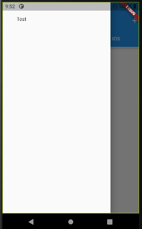

### 底部选项卡BottomNavigationBar

```dart
Scaffold(
      appBar: AppBar(
        title: Text("Flutter学习"),
      ),
      bottomNavigationBar: BottomNavigationBar(
          type: BottomNavigationBarType.fixed,
        items: [
          BottomNavigationBarItem(
            icon: Icon(Icons.add),
            title: Text("添加"),
          ),
          BottomNavigationBarItem(
            icon: Icon(Icons.home),
            title: Text("我的"),
          ),
        ],
        currentIndex: _index,
        onTap: (value) {
          setState(() {
            _index = value;
          });
        },
      ),
      body: widget.widgets[_index],
    );
//底部选项卡超出四个应该修改type为BottomNavigationBarType.fixed,否则选项卡不再显示
```

效果为：

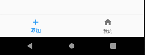

### 底部选项卡

```dart
Scaffold(
      appBar: AppBar(
        title: Text("Flutter学习"),
      ),
      bottomNavigationBar: BottomAppBar(
        color: Theme.of(context).primaryColor,
        shape: CircularNotchedRectangle(),
        child: Row(
          mainAxisAlignment: MainAxisAlignment.spaceAround,
          children: [
            IconButton(
              icon: Icon(Icons.add),
              onPressed: () {},
            ),
            IconButton(
              icon: Icon(Icons.home),
              onPressed: () {},
            ),
          ],
        ),
      ),
      floatingActionButtonLocation: FloatingActionButtonLocation.centerDocked,
      floatingActionButton: FloatingActionButton(
        child: Icon(Icons.widgets_rounded),
        onPressed: () {
          print("object");
        },
      ),
      body: widget.widgets[_index],
    );
```

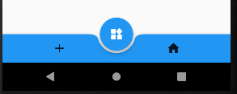

### 列表ListView

```dart

class Demo extends StatefulWidget {
  const Demo({Key key}) : super(key: key);

  @override
  State<Demo> createState() => _DemoState();
}

class _DemoState extends State<Demo> {
  List<int> list = List();
  ScrollController _controller;
  bool show = false;
  @override
  void initState() {
    super.initState();
    _controller = ScrollController();
    _controller.addListener(() {
      if (_controller.offset > 100 && show == false) {
        setState(() {
          show = true;
        });
      } else if (_controller.offset <= 100 && show == true) {
        setState(() {
          show = false;
        });
      }
    });
    for (int i = 0; i <= 100; i++) {
      list.add(i);
    }
  }

  @override
  void dispose() {
    // TODO: implement dispose
    super.dispose();
    _controller.dispose();
  }

  @override
  Widget build(BuildContext context) {
    return Scaffold(
      appBar: AppBar(
        title: Text("列表滚动"),
      ),
      floatingActionButton: show
          ? FloatingActionButton(
              child: Icon(
                Icons.add,
              ),
              onPressed: () {
                _controller.animateTo(0,
                    duration: Duration(milliseconds: 300), curve: Curves.ease);
              })
          : null,
      body: Scrollbar(
        child: RefreshIndicator(
          // child: ListView(
          //   // shrinkWrap: true,
          //   // reverse: true,
          //   children: list.map((e) => Text(e.toString())).toList(),
          // ),
          child: ListView.builder(
            itemBuilder: (BuildContext context, int index) {
              return Text(list[index].toString());
            },
            itemCount: list.length,
            controller: _controller,
          ),
          onRefresh: _onRefresh,
        ),
      ),
    );
  }

  // ignore: missing_return
  Future _onRefresh() async {
    await Future.delayed(Duration(seconds: 3), () {
      print("data");
    });
    return "";
  }
}

```

效果图为：

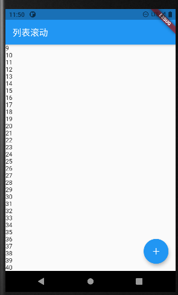

### 网格布局 GradView

```dart
 GridView(
        gridDelegate: SliverGridDelegateWithFixedCrossAxisCount(
          crossAxisCount: 3,
          mainAxisSpacing: 10,
          crossAxisSpacing: 10,
        ),
     scrollDirection: Axis.horizontal,//排列方向
        shrinkWrap: true,
        children: [
          Container(
            width: 50,
            height: 50,
            color: Colors.lightBlue,
          ),
          Container(
            width: 50,
            height: 50,
            color: Colors.orange,
          ),
          Container(
            width: 50,
            height: 50,
            color: Colors.green,
          ),
          Container(
            width: 50,
            height: 50,
            color: Colors.yellow,
          ),
          Container(
            width: 50,
            height: 50,
            color: Colors.red,
          ),
        ],
      ),
```

效果图为：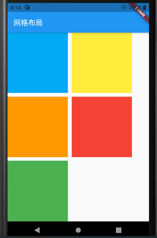

### 弹窗AlertDialog

```dart
 @override
  Widget build(BuildContext context) {
    return Scaffold(
      appBar: AppBar(
        title: Text("网格布局"),
      ),
      body: Column(
        children: [
          RaisedButton(
            onPressed: _showAlert,
            child: Text("对话框"),
          ),
        ],
      ),
    );
  }

  void _showAlert() async {
    var result = await showDialog(
      context: context,
      builder: (BuildContext context) {
        return AlertDialog(
          title: Text("弹窗"),
          content: Text("是否确定"),
          actions: [
            FlatButton(
              onPressed: () {
                Navigator.of(context).pop(false);
              },
              child: Text("取消"),
            ),
            FlatButton(
              onPressed: () {
                Navigator.pop(context, true);
              },
              child: Text("确定"),
            ),
          ],
        );
      },
    );
    print(result);
  }
```

效果图为：

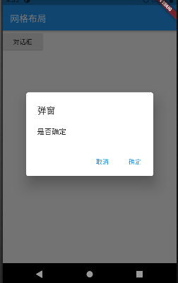

### 弹窗SimpleDialog

```dart
import 'package:flutter/material.dart';

void main() {
  runApp(MaterialApp(
    checkerboardOffscreenLayers: true,
    home: Demo(),
  ));
}

class Demo extends StatefulWidget {
  const Demo({Key key}) : super(key: key);

  @override
  State<Demo> createState() => _DemoState();
}

class _DemoState extends State<Demo> {
  List<int> list = [];
  @override
  void initState() {
    super.initState();
    for (int i = 0; i <= 30; i++) {
      list.add(i);
    }
  }

  @override
  Widget build(BuildContext context) {
    return Scaffold(
      appBar: AppBar(
        title: Text("网格布局"),
      ),
      body: Column(
        children: [
          RaisedButton(
            onPressed: _showAlert,
            child: Text("对话框"),
          ),
          RaisedButton(
            onPressed: _showListDialog,
            child: Text("列表对话框"),
          ),
        ],
      ),
    );
  }

  void _showListDialog() async {
    var result = await showDialog(
        barrierDismissible: false, //点弹窗之外不允许关闭弹窗
      context: context,
      builder: (BuildContext context) {
        return SimpleDialog(
          title: Text("弹窗"),
          children: list
              .map((e) => GestureDetector(
                    child: Text(e.toString()),
                    onTap: () {
                      Navigator.pop(context, e);
                    },
                  ))
              .toList(),
        );
      },
    );
    print(result);
  }

  void _showAlert() async {
    var result = await showDialog(
      context: context,
      builder: (BuildContext context) {
        return AlertDialog(
          title: Text("弹窗"),
          content: Text("是否确定"),
          actions: [
            FlatButton(
              onPressed: () {
                Navigator.of(context).pop(false);
              },
              child: Text("取消"),
            ),
            FlatButton(
              onPressed: () {
                Navigator.pop(context, true);
              },
              child: Text("确定"),
            ),
          ],
        );
      },
    );
    print(result);
  }
}

```

### 表格Table

```dart
Padding(
        padding: EdgeInsets.all(10),
        child: Table(
          border: TableBorder.all(
            color: Colors.grey,
          ),
          children: list
              .map(
                (e) => TableRow(children: [
                  Text(e["name"]),
                  Text(e["sex"]),
                ]),
              )
              .toList(),
        ),
      ),
```

效果图为：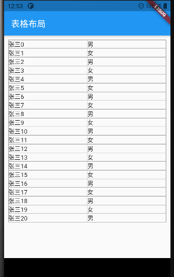

```dart
DataTable(
        columns: [
          DataColumn(
            label: Text("姓名"),
          ),
          DataColumn(
            label: Text("性别"),
          ),
        ],
        rows: list
            .map(
              (e) => DataRow(
                cells: [
                  DataCell(
                    Text(
                      e["name"],
                    ),
                  ),
                  DataCell(
                    Text(e["sex"]),
                  ),
                ],
              ),
            )
            .toList(),
      ),
```

效果图为：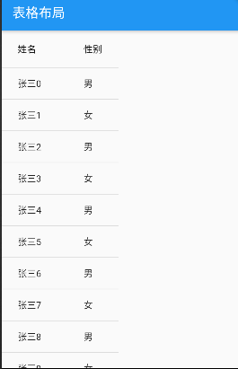


### Provider全局状态管理

**在pubspec.yaml文件写入**

```dart
# 全局状态管理
  provider: ^6.0.2
```

**CountProvider.dart**

```dart
import 'package:flutter/cupertino.dart';

class CountProvider extends ChangeNotifier {
  int _count = 0;

  get count => _count;

  void add() {
    _count++;
    notifyListeners(); //刷新页面
  }
}

```

**主类**

```dart
import 'package:flutter/material.dart';
import 'package:provider/provider.dart';
import 'package:learning_project/provider/CountProvider.dart';
void main() {
  runApp(
    ChangeNotifierProvider(
      create: (context) => CountProvider(),
      child: Demo(),
    ),
  );
}

class Demo extends StatelessWidget {
  const Demo({Key key}) : super(key: key);

  @override
  Widget build(BuildContext context) {
    return Scaffold(
      appBar: AppBar(
        title: Text("Provider全局状态管理"),
      ),
      body: Text(
        Provider.of<CountProvider>(context).count.toString(),
      ),
      floatingActionButton: FloatingActionButton(
        onPressed: () {
          context.read<CountProvider>().add();
        },
        child: Icon(Icons.add),
      ),
    );
  }
}
```

**共享多个状态**

```dart
void main() {
  runApp(
    MultiProvider(
      providers: [
        ChangeNotifierProvider(
          create: (context) => CountProvider(),
        ),
        ChangeNotifierProvider(
          create: (context) => CountProvider(),
        ),
        ChangeNotifierProvider(
          create: (context) => CountProvider(),
        ),
      ],
      child: MaterialApp(
        home: Demo(),
      ),
    ),
  );
}
```

### Dio网络请求

```dart
import 'package:dio/dio.dart';
import 'package:flutter/material.dart';
void main() {
  runApp(MaterialApp(
    home: Demo(),
  ));
}

class Demo extends StatefulWidget {
  const Demo({Key key}) : super(key: key);

  @override
  State<Demo> createState() => _DemoState();
}

class _DemoState extends State<Demo> {
  Dio _dio = Dio();

  @override
  void initState() {
    super.initState();
    _dio.options.baseUrl = "http://api.td0f7.cn:8083/";
  }

  @override
  Widget build(BuildContext context) {
    return Scaffold(
      appBar: AppBar(
        title: Text("网络请求"),
      ),
      body: Container(
        width: 100,
        height: 50,
        decoration: BoxDecoration(
          color: Colors.red,
          gradient: LinearGradient(
            colors: [
              new Color(0xFFFFDEAD),
              new Color(0xFF98FB98),
              new Color(0xFF6495ED),
            ],
          ),
          border: Border.all(width: 1, color: Colors.black),
        ),
        child: Padding(
          padding: EdgeInsets.all(10),
          child: GestureDetector(
            onTap: _get,
            child: Text("请点击我！"),
          ),
        ),
      ),
    );
  }

  void _get() async {
    /**
   * get 查询
   * post 一般登录 注册
   * put 修改资源
   * delete 删除资源
   */
    // var result = await Dio().post("http://127.0.0.1:8080/");
    var result = await _dio.get(
      "dio/",
      queryParameters: {"id": 1},
    );
    print(result);
    var result1 = await _dio.get(
      "dio/",
      queryParameters: {"id": 1},
      options: Options(headers: {"token": "base"} //传头部参数
          ),
    );
    print(result1);
  }
}
```

### 设计模式Mvvm

**view层调用viewmodel,viewmodel通知model层，model层再发送请求返回给viewmodel,viewmodel处理返回结果并刷新view。**

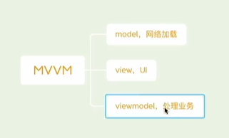