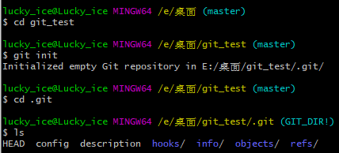
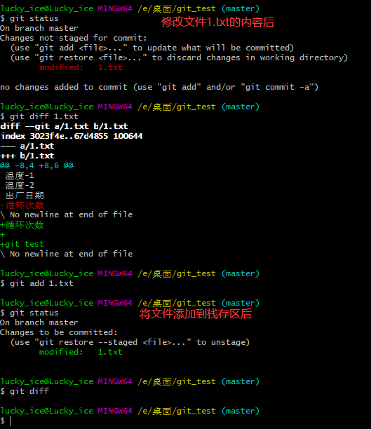
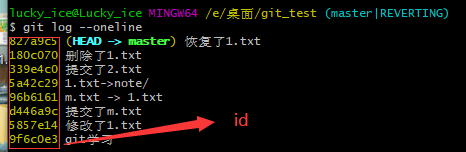
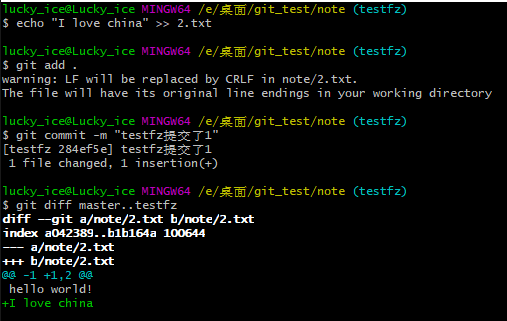
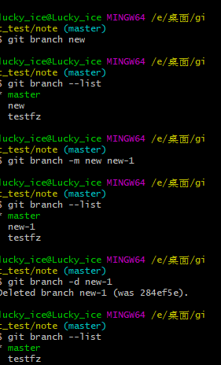
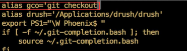
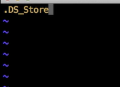

# Git基本命令

### 1. git help 帮助

查看命令帮助文档，**git [命令]** --help。

### 2. git config 配置管理

设置用户名称：git config --global user.name "用户名称"

取消设置：git config --unset --global user.name

查看环境详细配置：git config --list或者cat ~/.gitconfig

### 3. git init 初始化项目

一个项目初始化一次之后，git就会跟踪这个项目了。

### 4. git commit 提交描述信息

git commit -m "描述信息"

### 5. git diff 栈存区与工作目录的对比

查看栈存区与工作目录的对比结果，文件内容发生变动的对比。

git diff;

### 6. git rename 重命名

### 7. git mv移动文件

将1.txt移动到note目录下：git mv 1.txt /note

修改名称：git mv 1.txt m.txt

###  8. git rm 删除文件

修改了文件内容，还没有去提交文件，git rm 将会执行失败。

### 9. git head

git rm 【文件名】删除文件以后，还没有提交删除请求，可以使用 **git checkout HEAD -- 【文件名】** 命令来恢复文件。

提交了请求使用命**git checkout HEAD^ -- 【文件名】**来恢复文件。

### 10. git revert 恢复以往的提交

git log --oneline

git revert 【id号】

### 11. git reset

三个参数：

软重置：--soft 不会影响工作区和暂存区的内容

git reset --soft 【id】

--hard: 把工作区和暂存区直接指向指定位置。

git reset --hard【id】

默认状态：--mixed: 把暂存区中的内容重定指向指定位置。

### 12. git branch 查看分支

查看分支：git branch

创建分支：git branch testfz

切换当前所在分支：git checkout testfz

### 13. git checkout 切换

查看提交日志: git log --oneline --decorate

### 14. git branch diff 对比分区

查看分区：git branch

对比分区：git diff 【分区名】..【分区名】

### 15. git  fast forward 合并

与当前分支合并：git merge 【合并分支名称】

### 16. git merge 合并分支

git merge 【合并分支名称】

### 17. git conflict

### 18. rm branch

查看分支列表：git branch --list

创建分支：git branch new

修改分支名称：git branch -m new new-1

删除分支：git branch -d new-1

### 19. stash 保存工作进度

保存工作进度: git stash save "修改了1.txt"

查看工作进度列表 ：git stash list

对比目前工作状态与保存的工作状态的区别：git stash show -p 【代号】

将保存的工作状态恢复过来：git stash apply 【代号】

删除保存工作进度：git stash drop 【代号】

在恢复工作进度时，可以直接删除保存的工作进度：git stash pop 【代号】

### 20. log 查看提交日志

详细显示：git log

进度显示：git log --oneline

进度日志条数：git log --oneline -5

查看指定提交作者：git log --oneline --author="m_ice"

关于某个文件的提交：git log --oneline --grep="1.txt"

指定提交日期：git log --oneline --before='2022-3-20'

一周之前的提交：git log --oneline --before='1 week'

图形效果：git log --oneline --graph

### 21. alias 设置别名

设置checkout的别名：git config --global alias.co checkout

在系统中设置目录的别名：vim ~/.bash_profile

处理文件：source ~/.bash_profile

### 22. ignore  配置忽略列表

告诉git全局范围内，忽略的文件列表是：

git config -global core.excludesfile ~/.gitignore_global

编辑.gitignore_global，git忽略.DS_Store,这样配置后git不再跟踪这个文件。

### 23. girignore 配置忽略文件列表

在根目录下创建.girignore文件，编辑内容 *.log，告诉git忽略并且不再跟踪.log文件。

### 24. remote 版本库

查看远程：git remote

git remote -v

fetch：用于提取

push: 用于推送

### 25. origin 添加远程

git remote add origin 【远程版本库地址】

远程名称: origin

删除远程：git remote rm 【远程名称】

### 26. push 推送

将本地版本库中的分支推送到远程版本库中。

git push -u origin master

orgin: 远程名称

master: 远程的分支名称

查看本地分支：git branch

查看远程分支：git branch -r

### 27. remote workflow

### 28. clone 克隆

克隆远程版本库：git clone 【远程版本库地址】项目名称

### 29. fetch 提取

git fetch

### 30. fork  

### 31. pull request

### 32. collaborator 添加编辑用户

在github中点击【setting】 然后点击【Collaborator】 

### 33. github tools

### 34. brackets git