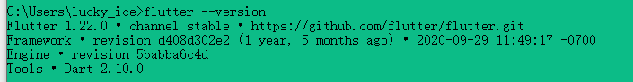

# 初识Flutter

## 1. 基础入门

### 1.1 准备开发工具和搭建开发环境

1. **下载Flutter:** https://docs.flutter.dev/development/tools/sdk/releases?tab=windows

2. **配置Flutter的环境变量**

   因为我们之后需要在命令行执行Flutter的命令，所以需要配置环境变量，macOS或者Linux系统，需要编辑~/.bash_profile文件：

   ```shell
   export PATH=$PATH:/Applications/flutter/binWindows用户将所在路径添加到环境变量的Path下
   ```

   Windows环境变量修改：点击计算机图标 - 属性 - 高级系统设置 - 高级 - 环境变量找到Path，在其中添加Flutter SDK目录下`bin目录`

   在终端中执行flutter --version，出现如下内容，说明安装flutter成功

   

   **配置镜像**

   flutter项目会依赖一些东西，在国内下载这些依赖会有一些慢，所以我们可以将它们的安装源换成国内的（也就是设置国内的镜像）

   macOS或者Linux操作系统，依然是编辑~/.bash_profile文件

   ```shell
   export PUB_HOSTED_URL=https://pub.flutter-io.cnexport FLUTTER_STORAGE_BASE_URL=https://storage.flutter
   ```

   Windows用户还是需要修改环境变量

   - Windows环境变量修改：点击计算机图标 - 属性 - 高级系统设置 - 高级 - 环境变量
   - 新建变量 PUB_HOSTED_URL，其值为https://pub.flutter-io.cn
   - 新建变量 FLUTTER_STORAGE_BASE_URL， 其值为https://storage.flutter-io.cn

   **注意：** 此镜像为临时镜像，并不能保证一直可用，大家可以参考详情请参考 **Using Flutter in China**[1] 以获得有关镜像服务器的最新动态。

3. 配置Android环境

4. 下载安装vscode

   使用VSCode开发Flutter我们需要安装两个插件：Flutter和Dart

5. 使用命令flutter doctor 查看可用设备

   

### 1.2 快速上手Flutter开发


### 1.3 Flutter必备基础知识 

## 2. 进阶提升

### 2.1 App导航框架和核心小部件

### 2.2 Flutter提交表单和状态管理

### 2.3 网络编程与数据存储

## 3. 进阶实战

### 3.1 人民旅游项目中短信验证

### 3.2 人民旅游实现推送消息、集成微信分享功能

### 3.3 小七旅游实现动画效果

## 4.实战拓展

### 4.1 打包发布Flutter应用

### 4.2 Flutter屏幕适配与优化

### 4.3 Flutter与Native混合开发


